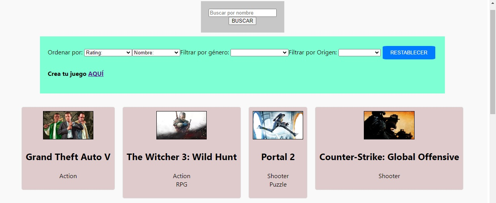
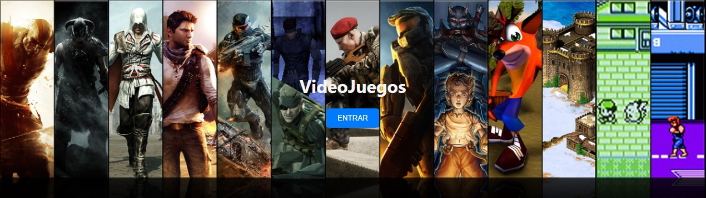

# 🎮 Sistema de Gestión de Videojuegos 🎮


## Descripción del Proyecto

Este proyecto es una **Single Page Application (SPA)** que permite buscar, filtrar, ordenar, visualizar, actualizar y crear información de videojuegos a partir de datos obtenidos desde una API externa. Está desarrollado utilizando **React** para el front-end y **Node.js** con **Express** para el back-end, conectado a una base de datos **PostgreSQL** mediante **Sequelize**.

### Funcionalidades Principales
- **Búsqueda** de videojuegos por nombre.
- **Filtrado** por géneros y origen (API o base de datos).
- **Ordenamiento** ascendente y descendente por nombre y rating.
- **Paginado** para mostrar los resultados de búsqueda.
- **Detalle** de cada videojuego con toda su información.
- **Formulario** para la creación de nuevos videojuegos.

## 🛠️ Tecnologías Utilizadas

### Front-End:
- **React** (v17.0.1)
- **Redux** para el manejo del estado global.
- **CSS** para los estilos.

### Back-End:
- **Node.js** (v12.18.3 o mayor)
- **Express** para crear el servidor y manejar las rutas.
- **Sequelize** para la interacción con la base de datos.

### Base de Datos:
- **PostgreSQL** como sistema de gestión de bases de datos.
- **Sequelize** como ORM.

### API Externa:
- [RAWG API](https://rawg.io/apidocs) para obtener información de videojuegos.

## 🚀 Funcionalidades

### Rutas del Back-End:
- **GET /videogames**: Obtiene un listado de videojuegos (API y base de datos).
- **GET /videogames/:idVideogame**: Obtiene el detalle de un videojuego por ID.
- **GET /videogames?name=...**: Busca videojuegos por nombre.
- **POST /videogames**: Crea un nuevo videojuego en la base de datos.
- **GET /genres**: Obtiene todos los géneros de videojuegos desde la API.

### Páginas del Front-End:
- **Landing Page**: Página de bienvenida con un botón para acceder a la aplicación.
- **Home Page**: Página principal con barra de búsqueda, filtros y paginado.
- **Detail Page**: Muestra el detalle completo de un videojuego seleccionado.
- **Form Page**: Formulario controlado para la creación de nuevos videojuegos.

## 📋 Instrucciones para Ejecutar el Proyecto

### Requisitos previos:
1. Tener instalada la versión estable más reciente de **Node.js** y **npm**:
    ```bash
    node -v
    npm -v
    ```
2. Tener **PostgreSQL** instalado y configurado.

### Configuración del Proyecto:
1. Clonar este repositorio:
    ```bash
    git clone https://github.com/tu-usuario/videogames.git
    ```

2. Instalar las dependencias del servidor y cliente:
    ```bash
    cd api
    npm install
    cd ../client
    npm install
    ```

3. Crear un archivo **`.env`** en la carpeta **api** con la siguiente configuración:
    ```env
    DB_USER=tuUsuarioDePostgres
    DB_PASSWORD=tuPasswordDePostgres
    DB_HOST=localhost
    API_KEY=tuApiKeyDeRAWG
    ```

4. Crear la base de datos llamada `videogames` en PostgreSQL:
    ```bash
    psql -U postgres
    CREATE DATABASE videogames;
    ```

5. Iniciar el servidor en la carpeta **api**:
    ```bash
    npm start
    ```

6. Iniciar el cliente en la carpeta **client**:
    ```bash
    npm start
    ```

## 🔍 Vista Previa del Proyecto

| Landing Page | Home Page |
|--------------|-----------|
|  |  |

## 🤝 Contribuciones

¡Las contribuciones son bienvenidas! Si deseas mejorar este proyecto, puedes hacer un fork del repositorio, crear una rama con tu función o mejora, y luego enviar un pull request.

1. Haz un fork del proyecto.
2. Crea una nueva rama (`git checkout -b feature/AmazingFeature`).
3. Realiza los cambios y haz un commit (`git commit -m 'Add some AmazingFeature'`).
4. Sube tu rama (`git push origin feature/AmazingFeature`).
5. Abre un Pull Request.

## 📧 Contacto

Si tienes alguna pregunta, no dudes en ponerte en contacto:

- **Manuel Harris** - [LinkedIn](https://www.linkedin.com/in/manuel-harris-83a365265/)
- **Email** - harrisdm.dev@gmail.com
- Proyecto en [GitHub](https://github.com/H4RR1S-D3V/videogames)

